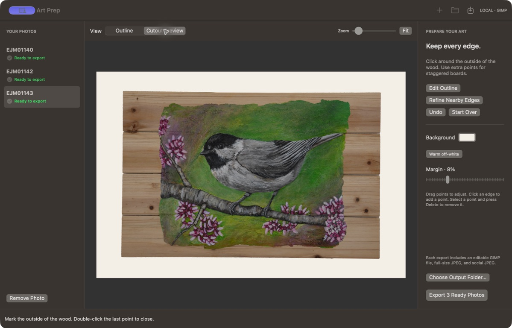

# Art Prep



A local Mac app for preparing photographs of paintings with wooden or irregular frames.
You mark the artwork boundary; Art Prep uses your installed GIMP to replace the surrounding
background and export editable and social-ready copies. Your photos stay on this Mac.

## Use the app

Requires macOS 14 or later and **GIMP 3** in `/Applications` or `~/Applications`.
Download the Apple Silicon build from [GitHub Releases](https://github.com/kindlyops/artprep/releases/latest).
Unzip the downloaded archive, move **Art Prep.app** to
Applications, and open it. Check the release notes for signing and notarization status;
the older v1.0.0 and v1.0.1 downloads are locally signed, not Apple-notarized.
Keep the app outside an iCloud-synced Documents folder: iCloud can add bundle attributes
that invalidate local code-signing verification.

1. **Add Photos** and select JPEG or PNG files. iCloud photos must be downloaded locally.
2. Click around the **outside of all the wood**, in order. Use four corners for a rectangle
   and extra points for an irregular frame. Double-click the last point or click **Close Outline**.
3. Drag points to adjust them. Click an existing edge to insert a point; select a point and
   press Delete to remove it. **Undo** restores the previous outline edit. Use Zoom and scrollbars
   for close work; **Fit** restores the overview.
4. Optionally choose **Refine Nearby Edges**. This searches within eight original-image pixels,
   adds points along edges, and keeps your corners. Review the visible result and Undo if an
   object or shadow pulls the edge the wrong way. It is a small adjustment, not automatic selection.
5. Check **Cutout Preview**, background color, and margins. The default is warm off-white
   `#F3EFE7`. Portrait canvases are 4:5; landscape canvases are 3:2, chosen from the outline bounds.
6. Choose an output folder and **Export Ready Photos**. Each closed outline is exported in order.
   Failed photos remain in the queue for another attempt. **Stop after this photo** finishes the
   current photo, then stops the batch.

Each export creates a new `photo-name-art-prep` folder (numbered on subsequent exports):

- `artwork.xcf`: editable artwork mask, background, and hidden cropped original reference.
- `full.jpg`: full-resolution composition with an embedded sRGB profile.
- `social.jpg`: sRGB JPEG, 2000 pixels on the long edge (small originals are upscaled).
- `outline.artprep`: the outline and settings needed to repeat this export.

Source photos are never overwritten. Camera metadata is omitted from JPEG exports. Exposure,
paint texture, perspective, and photographed color are not retouched. The preview shows the
reviewed polygon; GIMP adds a subtle 1.2-pixel feather to the final mask.

**Save Project** saves the whole queue and unfinished outlines as a readable `.artprep` JSON file.
Use **Open Project** to resume. Projects reference the original photo paths; keep those photos
in place. Moving or renaming a source requires adding it again. The hidden XCF reference is
cropped to the output canvas, so retain the original photo as your master.

## App updates

Developer ID releases include **Check for Updates…** in the Art Prep menu and an
**Automatically Check for Updates** toggle. Checks start enabled; you choose when to install.
Updates wait for active operations, and the usual unsaved-outline warning still protects your work.
GitHub serves the signed update feed and ZIP; photos and projects are never uploaded.
Unsigned development builds do not check for updates.

Versions through v1.0.2 need one manual download of the first updater-enabled release.
Move the app into Applications before using updates; an app running from a read-only location
cannot replace itself. GIMP updates remain separate.

## Git history

The source and progress history are hosted at [kindlyops/artprep](https://github.com/kindlyops/artprep).
Released source is on `main`; development changes use feature branches and pull requests.
Run `git log --oneline` to follow the checkpoints. Release tags identify the corresponding source.

```sh
git clone https://github.com/kindlyops/artprep.git
cd artprep
```

Only source, tests, build scripts, and documentation are tracked. Photos, generated exports,
app bundles, temporary caches, and the development virtual environment are excluded.

## Original design

The [original design memo](docs/art-prep-design-memo.html) records the approved app proposal.
It is preserved unchanged as a self-contained HTML document. Download it and open it in a browser
for the formatted presentation; the usage guide above describes the current app.

## Build and check

The app uses system SwiftUI/AppKit, CoreGraphics, ImageIO, and Sparkle for signed updates.
The build fetches the exact Sparkle release pinned in `scripts/sparkle-version.env` and verifies
its SHA-256 before preparing the local binary package. Its combined license notices are included in the app’s Resources folder. Python renderer code runs inside GIMP's own interpreter; users need no Python install.
Build with a Swift 6 toolchain and macOS SDK:

```sh
bash scripts/build.sh
```

The script builds on local temporary storage, signs the app, and writes the app and ZIP to `dist/`.
`ARTPREP_BUILD_ROOT` may override the temporary build folder. Build for the current machine's
architecture. This development command uses an ad-hoc signature. Use the release command below
for Developer ID signing and Apple notarization.

## Publish a release

Merges to `main` trigger [Request macOS release](.github/workflows/release.yml) on a hosted runner.
It dispatches the private `kindlyops/artprep-build` workflow, which validates the merged commit
before allocating the macOS ARM64 signing runner. It selects the next patch version.
The runner needs repository access and the Keychain/tool setup in the
[release guide](docs/releasing.md#github-actions-runner).

Once on each release Mac, connect an existing notarization Keychain profile:

```sh
./scripts/release.sh setup YOUR_KEYCHAIN_PROFILE
```

Then, from clean, merged, up-to-date `main`, use one command with the next unused version:

```sh
./scripts/release.sh 1.0.2
```

This runs checks, builds, signs with Developer ID and Hardened Runtime, notarizes, staples the
ticket, verifies the extracted archive, and publishes a GitHub release with the ZIP, SHA-256,
and signed Sparkle feed. Uploaded draft assets are verified before the release becomes latest.
The version is written into the app and GitHub tag; no source version edit is required.
Passwords stay in Keychain. [Release setup and troubleshooting](docs/releasing.md) covers
new credentials, certificate selection, required tools, and interrupted releases.

Development checks use Swift's test runner, swift-format, uv, Ruff, ty, pytest, shellcheck,
shfmt, actionlint, zizmor, and prek. Python 3.13 test dependencies are pinned with hashes:

```sh
uv venv --python 3.13
uv pip install --require-hashes -r requirements-dev.txt
prek install
prek auto-update --cooldown-days 7
prek run --all-files
```

For real GIMP integration tests, also install ImageMagick, build the app, and run:

```sh
ARTPREP_APP="$PWD/dist/Art Prep.app/Contents/MacOS/ArtPrep" .venv/bin/pytest -q
```

These tests verify output pixels, sRGB profiles, dimensions, Unicode/quoted paths, original-file
hashes, repeated exports, grayscale inputs, and malformed projects. Swift tests cover outline
geometry, margins, saved-project validation, EXIF orientation, edge refinement, and operation guards.
`ty` checks the pure Python request validator; GIMP's dynamically supplied GI API is verified by
the integration tests. Integration tests are skipped when `ARTPREP_APP` is not set.

## Command-line use

Agents and scripts can export the same saved projects without driving the interface:

```sh
"/Applications/Art Prep.app/Contents/MacOS/ArtPrep" \
  --render "/path/to/Paintings.artprep" --output "/path/to/existing/export-folder"
```

Only closed outlines are exported. The command prints each new export folder and returns a
nonzero exit code on failure. GUI batches continue past failed photos; the CLI stops at the first
failure. When running an unbundled development executable, set `ARTPREP_RENDERER` to this
repository's `renderer` folder. Paths are passed as data, never interpolated into shell commands.
